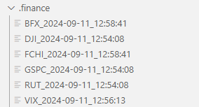
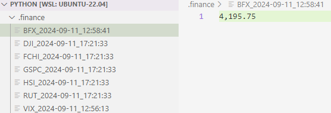

# PA7: Python Programming (100 pts)

## Learner Objectives
At the conclusion of this programming assignment, participants should be able to:
* Write Python scripts 
* Use Python constructs
* Scrape the static website that does not require authentication using **request** and **BeautifulSoup** libraries

## Prerequisites
* Understanding of the lessons taught on Python Programming
* Read [Beautiful Soup: Build a Web Scraper With Python](https://realpython.com/beautiful-soup-web-scraper-python/ )


## Program Details

Using Python, write a utility called **`stock`** that satisfies the following specifications:

*Utility:* **`stock {stockSymbol}`**

**`stock {stockSymbol}'** should
## Requirements
 - [ ] Create a  `.finance` directory in the current directory, if it does not already exist.
 - [ ] **`stock {stockSymbol}`** should access [https://finance.yahoo.com/markets/world-indices/](https://finance.yahoo.com/markets/world-indices/) and find the information for each `stock symbol` user enter in the command line
> **Note:** The user should be able to enter the stock symbols using lower or upper characters. For example `BFX` or `bfx` are both valid entries.
> **Note:** On the website, the stock symbol presides by the `^` symbol. Your program should not ask the user to enter this symbol.
 - [ ] Print full stock name and current stock price to the console
 - [ ] Search for the file starting with stockSymbol in the `.finance` directory
 - [ ] If the file exists,
     - [ ] Print the old stock price for this stock and display the difference in price since the last check
     - [ ] Remove the old file
- [ ] Save the current stock price in the file named `<stockSymbol>_<yyyy-mm-dd>_<hh:mm:ss>`
- [ ] Example:
       ````
       BFX_2024-09-11_12:58:41
       ````

## Example of output
### Context of ./finance directory before program run


### Program Run
```bash
$ ./stock GSPC DJI RUT HSI FCHI
S&P 500
Curent price is $5,554.13
The old price was $5,537.98
Price decrease by $-16.15 since you last check on 2024-09-11 12:54:08

Dow Jones Industrial Average
Curent price is $40,861.71
The old price was $40,779.69
Price decreased by $-82.02 since your last check on 2024-09-11 12:54:08

Russell 2000
Curent price is $2,103.85
The old price was $2,104.98
Price increase by $1.13 since you last check on 2024-09-11 12:54:08

HANG SENG INDEX
Curent price is $17,108.71

CAC 40
Curent price is $7,396.83
Old price was $7,396.83
Price has not changed since you last checked on 2024-09-11 12:58:41
```
### Context of ./finance directory before program run


> **Note:** Each file contains the ONLY stock price. The last check time is retrieved from the file name, not from some other storage.
> **Note:** The format of your program output must match mine

## Submitting Assignments
1. Test your code in the Codespace.
2. Ensure that you `push` your local copy of this PA's repo to GitHub. Verify that the code in GitHub is the same code you have on your local computer.
3. It is VERY IMPORTANT that besides pushing the code to GitHub you still submit the GitHub URL of this programming assignment in Canvas. This allows the instructor to be notified of your final submission and that you are ready for grading.

> **_NOTE: By submitting your code to be graded, you are stating that your submission does not violate the Academic Integrity Policy outlined in the syllabus._**
